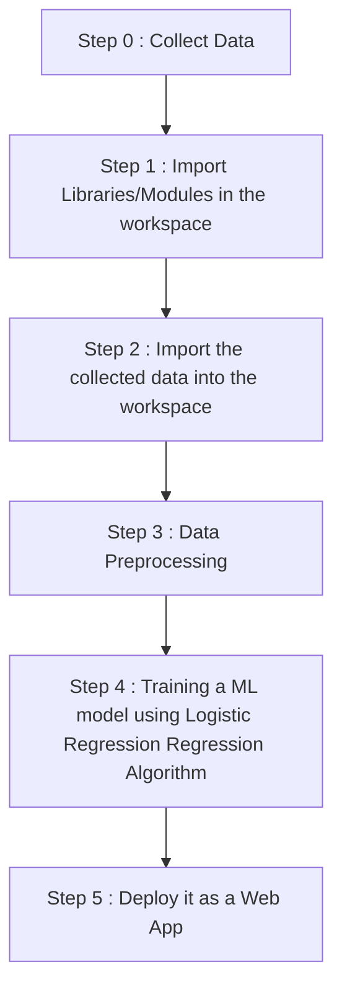

# Diabetes-Prediction-Web-App-using-Streamlit

This is a Machine Learning project of Diabetes Prediction which is deployed as a Web App using Streamlit Cloud.

Link to the web app : 

<h2 align='center'>WORKFLOW OF THE PROJECT</h2>

